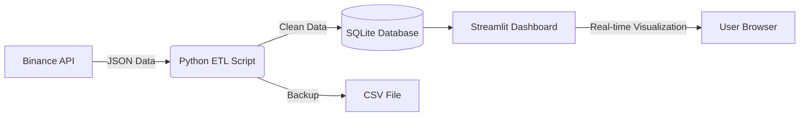

# 🪙 Real-Time Crypto ETL Pipeline

Bu proje, **Binance Public API** kullanarak canlı kripto para verilerini çeken, işleyen, yerel bir **SQLite** veritabanında saklayan ve **Streamlit** ile anlık olarak görselleştiren uçtan uca (End-to-End) bir veri mühendisliği projesidir.


## 🏗️ Proje Mimarisi



## 📋 Özellikler

### ⚡ **Extract**
- `requests` kütüphanesi ile çoklu coin (BTC, ETH, SOL vb.) verisi çekimi
- Binance Public API entegrasyonu
- Timeout ve hata yönetimi

### 🔄 **Transform**
- Ham JSON verisinin temizlenmesi
- Otomatik zaman damgası eklenmesi
- Tip dönüşümleri ve veri normalizasyonu

### 💾 **Load**
- Verilerin SQLite veritabanına yapısal olarak kaydedilmesi
- CSV formatında yedekleme
- Otomatik tablo oluşturma

### 🤖 **Automation**
- **Linux/Mac:** Bash script ile arka planda kesintisiz veri akışı
- **Windows:** PowerShell script ile process yönetimi
- Ctrl+C ile temiz çıkış mekanizması

### 📊 **Visualization**
- Streamlit ile otomatik güncellenen canlı fiyat grafikleri
- Anlık metrik kartları (toplam veri, son güncelleme, coin sayısı)
- İnteraktif tablo görünümleri

### ⚙️ **Configurable (Yapılandırılabilir)**
- `coins.json` üzerinden kod değiştirmeden yeni coin ekleme
- API endpoint özelleştirme desteği

## �️ Kurulum

### 1️⃣ Repoyu Klonlayın:

```bash
git clone https://github.com/korayga/kripto-etl-pipeline.git
cd kripto-etl-pipeline
```

### 2️⃣ Virtual Environment Oluşturun (Önerilen):

**Windows:**
```powershell
python -m venv .venv
.venv\Scripts\Activate.ps1
```

**Linux/Mac:**
```bash
python3 -m venv .venv
source .venv/bin/activate
```

### 3️⃣ Gerekli Kütüphaneleri Yükleyin:

```bash
pip install -r requirements.txt
```

### 4️⃣ Coin Listesini Yapılandırın:

`coins.json` dosyasını düzenleyerek takip etmek istediğiniz coinleri ekleyin:

```json
{
    "coins": [
        "BTCUSDT",
        "ETHUSDT",
        "BNBUSDT",
        "SOLUSDT",
        "ADAUSDT"
    ]
}
```

## 💻 Kullanım

Proje iki ana bileşenden oluşur: **Veri Toplayıcı (Back-end)** ve **Dashboard (Front-end)**.

### 🔹 1. Veri Akışını Başlat

#### **Manuel Çalıştırma **
```bash
python c.py

#test icin:    if __name__ == "__main__":
#                   while True: # eklenebilir
```


#### **Otomatik Çalıştırma **

**🐧 Linux/Mac:**
```bash
chmod +x veriler.sh
./veriler.sh
```

**🪟 Windows PowerShell:**
```powershell
# İlk seferinde execution policy ayarlayın
Set-ExecutionPolicy -Scope CurrentUser RemoteSigned

# Script'i çalıştırın
.\veriler.ps1
```

> 💡 **Not:** Bu script, `c.py` dosyasını her 5 saniyede bir otomatik çalıştırır. Durdurmak için `Ctrl+C` kullanın.

### 🔹 2. Dashboard'u Aç

Yeni bir terminal açın ve aşağıdaki komutu çalıştırın:

```bash
streamlit run dashboard.py
```

Tarayıcınızda otomatik olarak `http://localhost:8501` adresi açılacaktır.

### 📸 Dashboard Özellikleri

- 📈 **Canlı Grafik:** Tüm coinlerin fiyat hareketleri
- 💰 **Son Fiyatlar Tablosu:** Her coin için güncel fiyat
- 📊 **Metrikler:** Toplam veri sayısı, son güncelleme zamanı, takip edilen coin sayısı
- 🔄 **Otomatik Güncelleme:** Her 2 saniyede bir yenilenir

## 📁 Dosya Yapısı

```plaintext
kripto-etl-pipeline/
├── c.py                  # ETL işlemini yapan ana Python scripti
├── dashboard.py          # Veriyi görselleştiren Streamlit uygulaması
├── veriler.sh            # Linux/Mac için otomasyon scripti
├── veriler.ps1           # Windows PowerShell için otomasyon scripti
├── coins.json            # Takip edilecek coin listesi (Konfigürasyon)
├── requirements.txt      # Proje bağımlılıkları
├── .gitignore           # Git ignore dosyası
├── README.md            # Proje dokümantasyonu
├── kripto.db            # SQLite veritabanı (otomatik oluşur)
└── veriler.csv          # CSV yedek dosyası (otomatik oluşur)
```

### 📂 Dosya Açıklamaları

| Dosya | Açıklama |
|-------|----------|
| `c.py` | API'den veri çekme, temizleme ve veritabanına kaydetme |
| `dashboard.py` | Streamlit ile canlı veri görselleştirme |
| `veriler.sh` | Linux/Mac için otomatik veri toplama scripti |
| `veriler.ps1` | Windows için otomatik veri toplama scripti |
| `coins.json` | Takip edilecek cryptocurrency sembollerinin listesi |
| `kripto.db` | SQLite veritabanı dosyası (ilk çalıştırmada otomatik oluşur) |
| `veriler.csv` | Yedek CSV dosyası (append mode) |

## 🔧 Yapılandırma

### Coin Listesi Güncelleme

`coins.json` dosyasını düzenleyerek takip edilecek coinleri özelleştirebilirsiniz:

```json
{
    "coins": [
        "BTCUSDT",
        "ETHUSDT",
        "BNBUSDT",
        "SOLUSDT",
        "ADAUSDT",
        "DOGEUSDT",
        "XRPUSDT"
    ]
}
```


### API Endpoint Özelleştirme

Farklı bir API kullanmak isterseniz `c.py` dosyasındaki `base_url` değişkenini güncelleyebilirsiniz:

```python
base_url = "https://api.binance.com/api/v3/ticker/price?symbol="
# veya
base_url = "https://api.başka-exchange.com/..."
```

## 🗄️ Veritabanı Şeması

SQLite veritabanı (`kripto.db`) aşağıdaki yapıya sahiptir:

**Tablo:** `fiyatlar`

| Sütun | Tip | Açıklama |
|-------|-----|----------|
| `id` | INTEGER | Primary Key (Auto Increment) |
| `coin` | TEXT | Cryptocurrency sembolü (örn: BTCUSDT) |
| `price` | REAL | Anlık fiyat değeri |
| `time` | TEXT | Veri çekilme zamanı (YYYY-MM-DD HH:MM:SS) |

## 🚀 Teknoloji Stack

- **Python 3.10+** - Ana programlama dili
- **Requests** - HTTP API istekleri
- **Pandas** - Veri manipülasyonu ve CSV işlemleri
- **SQLite3** - Embedded veritabanı
- **Streamlit** - Web dashboard framework
- **Bash/PowerShell** - Otomasyon scriptleri


